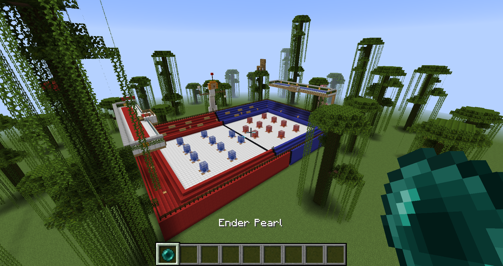

# Minecraft BeerPong

[](https://travis-ci.org/worepix/minecraft-beerepong)

Minecraft BeerPong Spigot Minectaft Server plugin and map.



## Install

1. Clone Repository

```
git clone https://github.com/worepix/minecraft-beerepong.git
```

2. Install java required for running Spigot

```
sudo apt install default-jre
```

3. Make server directory

```
mkdir server/
```

4. Move to server directory

```
cd server/
```

5. Download BuildTools for building Spigot server

```
wget https://hub.spigotmc.org/jenkins/job/BuildTools/lastSuccessfulBuild/artifact/target/BuildTools.jar
```

6. Now just run BuildScript

```
java -Xms1G -Xmx1G -XX:+UseConcMarkSweepGC -jar BuildTools.jar
```

7. Wait for build and Run Spigot Server

```
java -Xms1G -Xmx1G -XX:+UseConcMarkSweepGC -jar spigot-1.15.2.jar
```

8. Read and agree eula by rewriting `false` to `true` in `eula.txt` file

```
...
eula=true
...
```

9. Run Spigo Server again for generating necceseary files
```
java -Xms1G -Xmx1G -XX:+UseConcMarkSweepGC -jar spigot-1.15.2.jar
```

8. Go to repository root folder to move map

```
cd ../
```

9. Remove generated map and move BeerPong map

```
rm -rf server/world/ && mv world server/
```

10. Install jdk and maven for building plugin

```
sudo apt-get update && sudo apt install default-jdk && sudo apt-get install maven
```

11. Build plugin. Build script will also move generated plugin into your generated Spigot server plugins folder.

```
./build.sh
```